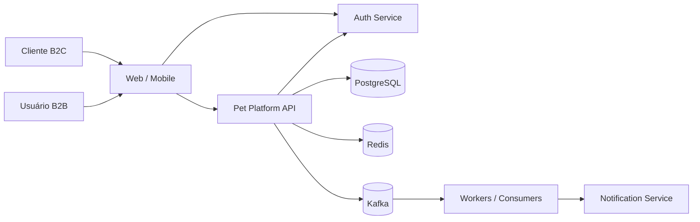
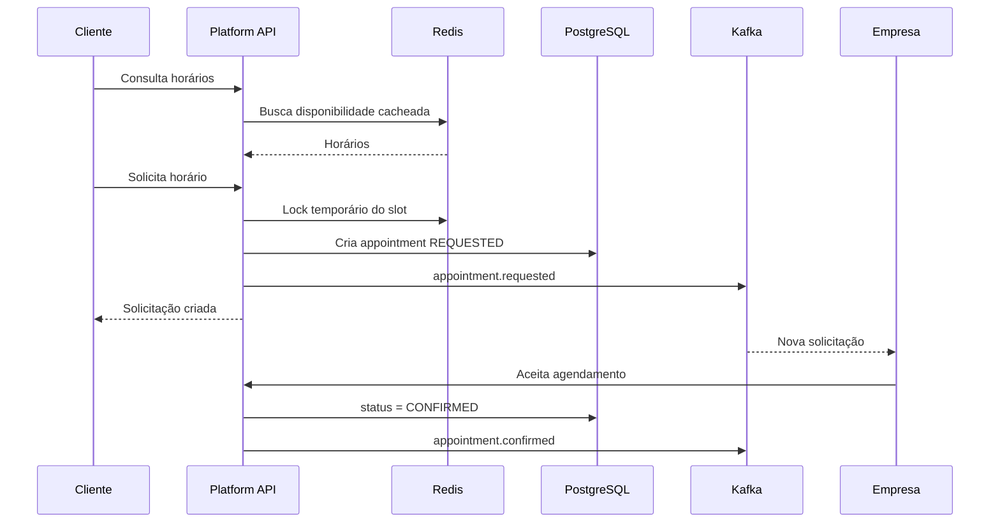
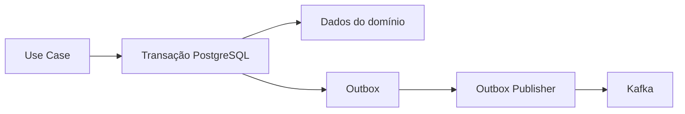
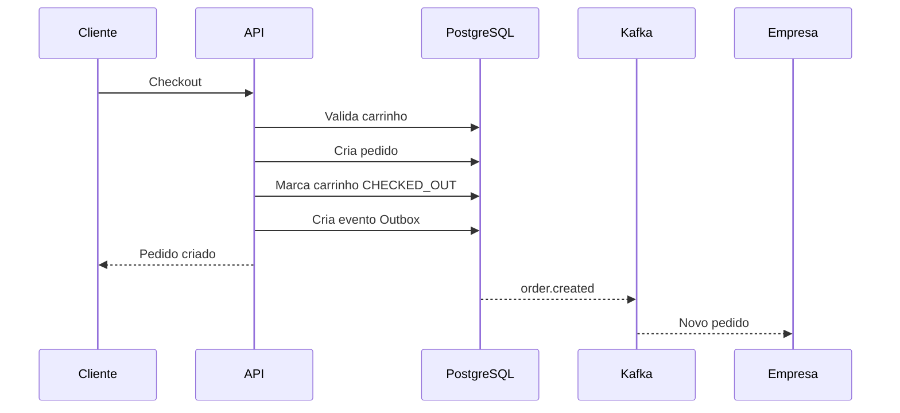
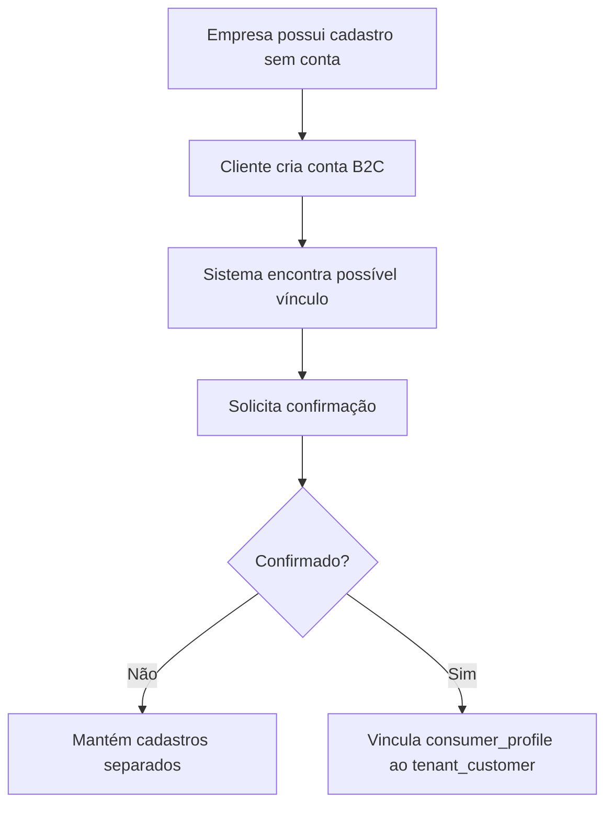

5.# Documentação do Projeto — Plataforma SaaS Pet/Veterinária

Fluxos de identidade, cadastro B2C e cadastro empresarial direto: `docs/AUTH_ONBOARDING.md`.

> Documento de arquitetura e produto para uma plataforma multi-tenant voltada a clínicas veterinárias, banho e tosa e pet shops, com operação B2B, experiência B2C e vitrine pública/marketplace.

---

## 1. Visão geral

O sistema será uma plataforma SaaS multi-tenant para empresas do segmento pet, permitindo que cada empresa utilize o sistema como ferramenta operacional e, simultaneamente, possua uma vitrine pública para seus clientes.

A plataforma possuirá dois grandes públicos:

- **B2B**: clínicas veterinárias, pet shops, banho e tosa e demais empresas do segmento.
- **B2C**: tutores de pets que desejam localizar empresas, visualizar produtos e serviços, realizar compras e solicitar agendamentos.

O projeto de autenticação já existente será a autoridade de identidade e autenticação, oferecendo suporte a usuários B2B e B2C.

Este projeto será responsável pelo domínio pet, catálogo, CRM, agenda, carrinho, pedidos e integrações.

---

# 2. Objetivos do sistema

## 2.1 Objetivos B2B

Permitir que empresas:

- criem e mantenham seu perfil comercial;
- cadastrem clientes;
- cadastrem pets dos clientes;
- cadastrem produtos;
- cadastrem serviços;
- controlem disponibilidade de agenda;
- criem agendamentos;
- recebam solicitações de agendamento;
- aceitem ou recusem solicitações;
- acompanhem pedidos;
- tenham uma página pública/vitrine;
- publiquem produtos e serviços;
- mantenham um CRM básico dos clientes.

## 2.2 Objetivos B2C

Permitir que consumidores:

- criem sua conta;
- mantenham seus dados;
- cadastrem seus pets;
- encontrem empresas;
- visualizem produtos;
- visualizem serviços;
- visualizem horários disponíveis;
- solicitem agendamentos;
- acompanhem agendamentos;
- adicionem produtos ao carrinho;
- realizem pedidos;
- consultem histórico de compras.

---

# 3. Escopo inicial

## MVP

O MVP deve conter:

1. integração com autenticação B2B/B2C;
2. cadastro da empresa;
3. perfil público da empresa;
4. cadastro de cliente;
5. cadastro de pet;
6. vínculo entre cliente B2C e cadastro do cliente na empresa;
7. catálogo de produtos;
8. catálogo de serviços;
9. agenda;
10. solicitação e aprovação de agendamento;
11. carrinho;
12. pedido;
13. eventos Kafka;
14. cache e locks com Redis;
15. auditoria básica;
16. notificações assíncronas.

## Pós-MVP

Funcionalidades recomendadas para fases posteriores:

- prontuário veterinário;
- vacinação;
- prescrições;
- anexos e documentos;
- histórico clínico;
- internação;
- estoque por lote;
- validade de produtos;
- meios de pagamento;
- PIX;
- recorrência;
- programa de fidelidade;
- cupons;
- avaliações;
- planos/pacotes;
- assinatura de serviços;
- comissionamento;
- marketplace multi-vendedor;
- delivery;
- integração fiscal;
- emissão de NFS-e/NF-e;
- BI e dashboards.

---

# 4. Arquitetura macro

A recomendação inicial é um **monólito modular**, preparado para evolução para microsserviços somente quando houver necessidade real de escala ou independência operacional.

Isso reduz complexidade no começo sem abrir mão de limites de domínio.



---

# 5. Stack sugerida

## Backend

- Java 21
- Spring Boot 3.x
- Spring Web
- Spring Validation
- Spring Security Resource Server
- Spring Data JPA
- Hibernate
- PostgreSQL
- Liquibase
- Apache Kafka
- Spring for Apache Kafka
- Redis
- Spring Data Redis
- Micrometer
- Actuator
- OpenAPI
- Testcontainers
- JUnit 5
- Mockito

## Infraestrutura

- PostgreSQL
- Kafka
- Redis
- Docker
- Docker Compose para desenvolvimento
- Kubernetes opcional em produção
- OpenTelemetry opcional
- Prometheus/Grafana opcional

---

# 6. Estratégia multi-tenant

## 6.1 Modelo recomendado

Inicialmente utilizar:

**Shared Database + Shared Schema + tenant_id**

Ou seja, os dados de várias empresas ficam no mesmo banco, mas registros pertencentes a empresas possuem obrigatoriamente um identificador de tenant.

Exemplo:

```text
catalog_product
---------------------------------
id
tenant_id
name
description
price
active
published
```

## 6.2 Regras obrigatórias

Toda entidade B2B deve possuir `tenant_id`.

Exemplos:

- customer;
- pet cadastrado pela empresa;
- employee;
- product;
- service;
- appointment;
- order;
- business configuration.

### Nunca confiar em `tenantId` enviado pelo frontend B2B.

O tenant deve ser obtido do JWT emitido pelo serviço de autenticação.

Exemplo de claims:

```json
{
  "sub": "user-uuid",
  "actor_type": "B2B",
  "tenant_id": 50000101,
  "roles": [
    "ADMIN",
    "SCHEDULING"
  ]
}
```

Para B2C:

```json
{
  "sub": "consumer-uuid",
  "actor_type": "B2C"
}
```

---

# 7. Identidade, consumidor, cliente e pet

É importante não confundir autenticação com cadastro comercial.

## 7.1 Auth User

É mantido pelo serviço de autenticação.

Responsabilidades:

- login;
- senha;
- MFA;
- refresh token;
- roles;
- tenants;
- identidade.

Este projeto não deve armazenar senha.

---

## 7.2 Consumer Profile

Representa o usuário B2C dentro da plataforma.

Tabela conceitual:

```text
consumer_profile
---------------------------------
id
auth_subject
name
email
phone
document
birth_date
created_at
updated_at
```

`auth_subject` referencia logicamente o `sub` do JWT.

---

## 7.3 Tenant Customer

Representa o cliente dentro do CRM de uma empresa.

```text
tenant_customer
---------------------------------
id
tenant_id
consumer_profile_id nullable
name
email
phone
document
notes
active
created_at
updated_at
```

A empresa pode cadastrar um cliente que ainda não possui conta na plataforma.

Nesse caso:

```text
consumer_profile_id = null
```

Posteriormente o consumidor poderá vincular sua conta ao cadastro existente.

---

# 8. Estratégia de vínculo B2C ↔ cadastro da empresa

Esse ponto é fundamental para evitar duplicação e problemas de privacidade.

## Cenário 1 — cliente se cadastra primeiro

1. B2C cria conta no Auth.
2. Plataforma cria `consumer_profile`.
3. B2C cadastra seu pet.
4. B2C solicita um serviço de uma empresa.
5. Sistema cria, se necessário, um `tenant_customer`.
6. `tenant_customer.consumer_profile_id` passa a apontar para o consumidor.

## Cenário 2 — empresa cadastra primeiro

1. Empresa cria `tenant_customer`.
2. Empresa cadastra o pet.
3. Futuramente cliente cria conta B2C.
4. Sistema identifica possível correspondência.
5. Cliente realiza processo de confirmação.
6. Cadastro é vinculado ao `consumer_profile`.

## Nunca fazer vínculo automático somente por nome.

Podem ser utilizados, com validação:

- CPF;
- e-mail confirmado;
- telefone confirmado;
- código enviado por SMS/e-mail;
- convite gerado pela empresa.

---

# 9. Modelo de pet

Existem dois conceitos.

## 9.1 Pet do consumidor

Pet global pertencente ao B2C.

```text
consumer_pet
---------------------------------
id
consumer_profile_id
name
species
breed
birth_date
sex
weight
color
microchip
neutered
created_at
updated_at
```

## 9.2 Pet conhecido pela empresa

Registro do pet dentro do contexto da empresa.

```text
tenant_pet
---------------------------------
id
tenant_id
tenant_customer_id
consumer_pet_id nullable
name
species
breed
birth_date
sex
weight
notes
active
created_at
updated_at
```

Isso evita compartilhar dados internos da clínica entre empresas.

### Regra

Um prontuário, observação veterinária ou anotação interna nunca deve ser compartilhado automaticamente entre tenants.

---

# 10. Módulos do sistema

Estrutura recomendada:

```text
com.miaupy
├── shared
├── tenant
├── consumer
├── customer
├── pet
├── business
├── catalog
├── scheduling
├── cart
├── order
├── notification
├── integration
└── audit
```

Cada módulo deve possuir seus próprios:

- controllers;
- application services;
- domain;
- repositories;
- DTOs;
- mappers;
- events.

---

# 11. Módulo Business

Responsável pela empresa e sua presença pública.

Entidade:

```text
business
---------------------------------
id
tenant_id
slug
name
trade_name
document
description
phone
email
website
active
public_visible
created_at
updated_at
```

Endereço:

```text
business_address
---------------------------------
id
business_id
street
number
district
city
state
postal_code
latitude
longitude
```

Configurações:

```text
business_settings
---------------------------------
tenant_id
appointment_approval_mode
timezone
currency
allow_online_booking
allow_online_sales
```

---

# 12. Vitrine pública

Cada empresa poderá possuir uma rota pública.

Exemplo:

```http
GET /api/v1/public/stores/{slug}
```

Produtos:

```http
GET /api/v1/public/stores/{slug}/products
```

Serviços:

```http
GET /api/v1/public/stores/{slug}/services
```

Agenda disponível:

```http
GET /api/v1/public/stores/{slug}/availability
```

A vitrine deve mostrar apenas itens:

```text
active = true
published = true
```

---

# 13. Catálogo de produtos

Entidade:

```text
product
---------------------------------
id
tenant_id
sku
name
description
price
promotional_price
stock_quantity
active
published
created_at
updated_at
```

Possíveis extensões:

```text
product_category
product_image
product_variant
product_stock
product_stock_batch
```

---

# 14. Catálogo de serviços

```text
service
---------------------------------
id
tenant_id
name
description
duration_minutes
price
active
published
requires_approval
created_at
updated_at
```

Exemplos:

- consulta veterinária;
- vacina;
- banho;
- tosa;
- banho + tosa;
- corte de unhas;
- hidratação;
- consulta de retorno.

---

# 15. Agenda

## Appointment

```text
appointment
---------------------------------
id
tenant_id
tenant_customer_id
tenant_pet_id
service_id
employee_id nullable
requested_by
start_at
end_at
status
notes
created_at
updated_at
```

## Status

```text
REQUESTED
CONFIRMED
REJECTED
CANCELLED
IN_PROGRESS
COMPLETED
NO_SHOW
```

## Origem

```text
CUSTOMER
BUSINESS
```

---

# 16. Fluxo de agendamento B2C



---

# 17. Evitando duplo agendamento

Redis pode ser utilizado como lock temporário:

```text
appointment:lock:{tenantId}:{employeeId}:{startAt}
```

Exemplo:

```text
SET key requestId NX PX 15000
```

Porém Redis não deve ser a única proteção.

Também deve existir proteção no PostgreSQL.

Exemplo de abordagem:

- lock lógico no Redis;
- transação;
- validação de conflito;
- constraint/índice quando possível;
- persistência;
- liberação do lock.

Para intervalos complexos, utilizar consulta de sobreposição:

```sql
WHERE start_at < :newEnd
AND end_at > :newStart
```

---

# 18. Carrinho

Recomendação:

O carrinho deve ser persistido no PostgreSQL.

Redis pode manter uma representação cacheada.

## Regra do MVP

Um carrinho pertence a apenas uma empresa.

Isso evita complexidade de marketplace multi-vendedor.

```text
cart
---------------------------------
id
consumer_profile_id
tenant_id
status
created_at
updated_at
```

```text
cart_item
---------------------------------
id
cart_id
product_id
quantity
unit_price
```

## Status

```text
ACTIVE
CHECKED_OUT
ABANDONED
```

---

# 19. Pedido

```text
customer_order
---------------------------------
id
tenant_id
consumer_profile_id
tenant_customer_id
status
subtotal
discount
total
created_at
updated_at
```

```text
order_item
---------------------------------
id
order_id
product_id
product_name
quantity
unit_price
total
```

## Importante

O pedido deve armazenar snapshots de:

- nome do produto;
- preço;
- quantidade.

Nunca depender do preço atual do catálogo para reconstruir um pedido antigo.

---

# 20. Estados do pedido

```text
CREATED
AWAITING_PAYMENT
PAID
PROCESSING
READY
COMPLETED
CANCELLED
REFUNDED
```

---

# 21. Redis

Usos recomendados:

## Cache público

```text
store:{slug}
store:{tenantId}:products
store:{tenantId}:services
```

## Disponibilidade

```text
availability:{tenantId}:{serviceId}:{date}
```

## Lock de agendamento

```text
appointment:lock:{tenantId}:{employeeId}:{startAt}
```

## Idempotência

```text
idempotency:{actorId}:{requestId}
```

## Rate limiting

```text
ratelimit:{actorId}:{route}
```

## Carrinho

O Redis pode acelerar leitura, mas PostgreSQL deve continuar sendo a fonte durável do carrinho.

---

# 22. Kafka

Kafka deve ser utilizado para comunicação assíncrona e propagação de eventos.

## Eventos sugeridos

```text
customer.created
customer.linked
pet.created
pet.linked

product.created
product.updated
product.published
product.unpublished

service.created
service.updated
service.published

appointment.requested
appointment.confirmed
appointment.rejected
appointment.cancelled
appointment.completed

cart.checked-out

order.created
order.paid
order.cancelled
order.completed

notification.requested
```

---

# 23. Envelope padrão de eventos

```json
{
  "eventId": "uuid",
  "eventType": "appointment.requested",
  "eventVersion": 1,
  "occurredAt": "2026-08-10T20:00:00Z",
  "tenantId": 50000101,
  "actor": {
    "type": "B2C",
    "id": "consumer-uuid"
  },
  "payload": {}
}
```

---

# 24. Outbox Pattern

Não publicar diretamente no Kafka dentro da mesma lógica sem garantia transacional.

Utilizar Outbox Pattern.

```text
domain_event_outbox
---------------------------------
id
aggregate_type
aggregate_id
event_type
payload
status
created_at
published_at
```

Fluxo:



Isso evita o problema:

> banco confirmou a transação, mas Kafka falhou.

---

# 25. Consumidores Kafka

Todo consumer deve ser idempotente.

Criar tabela ou Redis key para eventos processados quando necessário.

Exemplo:

```text
processed_event
---------------------------------
consumer_name
event_id
processed_at
```

Nunca assumir exactly-once no domínio somente porque Kafka está configurado.

---

# 26. Segurança

## B2B

O tenant deve ser extraído exclusivamente do JWT.

Exemplo:

```java
TenantContext.getRequiredTenantId();
```

Não permitir:

```http
POST /business/products
{
  "tenantId": 123
}
```

Preferir:

```http
POST /api/v1/business/products
{
  "name": "Ração Premium",
  "price": 129.90
}
```

O backend resolve o tenant.

## B2C

O consumidor deve acessar apenas recursos pertencentes ao próprio `sub`.

Nunca aceitar:

```http
GET /consumer/{consumerId}/pets
```

quando o próprio backend pode descobrir o consumidor pelo token.

Preferir:

```http
GET /api/v1/consumer/me/pets
```

---

# 27. Autorização

Roles B2B sugeridas:

```text
OWNER
ADMIN
RECEPTIONIST
VETERINARIAN
GROOMER
SALES
CATALOG_MANAGER
SCHEDULING_MANAGER
```

Authorities sugeridas:

```text
CUSTOMER_READ
CUSTOMER_WRITE

PET_READ
PET_WRITE

PRODUCT_READ
PRODUCT_WRITE

SERVICE_READ
SERVICE_WRITE

APPOINTMENT_READ
APPOINTMENT_CREATE
APPOINTMENT_CONFIRM
APPOINTMENT_CANCEL

ORDER_READ
ORDER_WRITE
```

---

# 28. APIs

## APIs públicas

```http
GET /api/v1/public/stores
GET /api/v1/public/stores/{slug}
GET /api/v1/public/stores/{slug}/products
GET /api/v1/public/stores/{slug}/products/{productId}
GET /api/v1/public/stores/{slug}/services
GET /api/v1/public/stores/{slug}/availability
```

---

## APIs B2C

### Perfil

```http
GET  /api/v1/consumer/me
PUT  /api/v1/consumer/me
```

### Pets

```http
GET    /api/v1/consumer/me/pets
POST   /api/v1/consumer/me/pets
GET    /api/v1/consumer/me/pets/{petId}
PUT    /api/v1/consumer/me/pets/{petId}
DELETE /api/v1/consumer/me/pets/{petId}
```

### Agendamento

```http
GET  /api/v1/consumer/me/appointments
POST /api/v1/consumer/me/appointments
POST /api/v1/consumer/me/appointments/{id}/cancel
```

### Carrinho

```http
GET    /api/v1/consumer/me/cart
POST   /api/v1/consumer/me/cart/items
PATCH  /api/v1/consumer/me/cart/items/{itemId}
DELETE /api/v1/consumer/me/cart/items/{itemId}
POST   /api/v1/consumer/me/cart/checkout
```

### Pedidos

```http
GET /api/v1/consumer/me/orders
GET /api/v1/consumer/me/orders/{orderId}
```

---

# 29. APIs B2B

## Clientes

```http
GET    /api/v1/business/customers
POST   /api/v1/business/customers
GET    /api/v1/business/customers/{id}
PUT    /api/v1/business/customers/{id}
DELETE /api/v1/business/customers/{id}
```

## Pets

```http
GET  /api/v1/business/customers/{customerId}/pets
POST /api/v1/business/customers/{customerId}/pets
PUT  /api/v1/business/pets/{petId}
```

## Produtos

```http
GET    /api/v1/business/products
POST   /api/v1/business/products
GET    /api/v1/business/products/{id}
PUT    /api/v1/business/products/{id}
DELETE /api/v1/business/products/{id}

POST /api/v1/business/products/{id}/publish
POST /api/v1/business/products/{id}/unpublish
```

## Serviços

```http
GET  /api/v1/business/services
POST /api/v1/business/services
PUT  /api/v1/business/services/{id}
```

## Agenda

```http
GET  /api/v1/business/appointments
POST /api/v1/business/appointments
POST /api/v1/business/appointments/{id}/confirm
POST /api/v1/business/appointments/{id}/reject
POST /api/v1/business/appointments/{id}/cancel
POST /api/v1/business/appointments/{id}/complete
```

## Pedidos

```http
GET /api/v1/business/orders
GET /api/v1/business/orders/{id}

POST /api/v1/business/orders/{id}/processing
POST /api/v1/business/orders/{id}/ready
POST /api/v1/business/orders/{id}/complete
POST /api/v1/business/orders/{id}/cancel
```

---

# 30. Estrutura de pacotes

Preferir organização por feature.

```text
src/main/java/com/miaupy
│
├── shared
│   ├── config
│   ├── security
│   ├── exception
│   ├── event
│   ├── tenant
│   └── validation
│
├── customer
│   ├── api
│   ├── application
│   ├── domain
│   └── infrastructure
│
├── pet
│   ├── api
│   ├── application
│   ├── domain
│   └── infrastructure
│
├── catalog
│   ├── api
│   ├── application
│   ├── domain
│   └── infrastructure
│
├── scheduling
│   ├── api
│   ├── application
│   ├── domain
│   └── infrastructure
│
├── cart
├── order
├── business
└── integration
```

Evitar organização global do tipo:

```text
controller
service
repository
entity
dto
```

pois isso mistura bounded contexts conforme o projeto cresce.

---

# 31. Camadas por módulo

Exemplo:

```text
catalog
├── api
│   ├── ProductController
│   ├── CreateProductRequest
│   └── ProductResponse
├── application
│   ├── CreateProductUseCase
│   └── PublishProductUseCase
├── domain
│   ├── Product
│   ├── ProductRepository
│   └── ProductPublishedEvent
└── infrastructure
    ├── persistence
    │   ├── ProductJpaEntity
    │   ├── SpringDataProductRepository
    │   └── ProductRepositoryAdapter
    └── messaging
```

Não é obrigatório implementar DDD cerimonial.

A intenção é manter:

- domínio;
- aplicação;
- infraestrutura;
- API;

claramente separados.

---

# 32. DTOs

Nunca expor entidades JPA diretamente no controller.

Exemplo:

```java
public record CreateProductRequest(
    @NotBlank String name,
    @NotNull @Positive BigDecimal price,
    String description
) {}
```

Resposta:

```java
public record ProductResponse(
    UUID id,
    String name,
    BigDecimal price,
    boolean published
) {}
```

---

# 33. IDs

Recomendação:

Utilizar UUID/UUIDv7 para entidades externas.

Exemplo:

```text
business
product
service
appointment
cart
order
consumer_profile
```

Benefícios:

- menor previsibilidade;
- melhor geração distribuída;
- menor dependência do banco;
- melhor exposição em API.

Caso a empresa já utilize IDs `BIGINT`, pode-se manter o padrão desde que não exista exposição sensível baseada apenas em IDs sequenciais.

---

# 34. Schemas PostgreSQL

Sugestão:

```text
platform
consumer
crm
pet
catalog
scheduling
sales
integration
audit
```

Exemplo:

```text
platform.business
consumer.consumer_profile
consumer.consumer_pet
crm.tenant_customer
pet.tenant_pet
catalog.product
catalog.service
scheduling.appointment
sales.cart
sales.cart_item
sales.customer_order
sales.order_item
integration.domain_event_outbox
```

---

# 35. Índices essenciais

Exemplos:

```sql
CREATE INDEX idx_product_tenant
ON catalog.product (tenant_id);

CREATE INDEX idx_product_public
ON catalog.product (tenant_id, published, active);

CREATE INDEX idx_customer_tenant_document
ON crm.tenant_customer (tenant_id, document);

CREATE INDEX idx_appointment_tenant_start
ON scheduling.appointment (tenant_id, start_at);

CREATE INDEX idx_order_tenant_created
ON sales.customer_order (tenant_id, created_at DESC);
```

Todas as consultas B2B frequentes devem começar pelo tenant.

---

# 36. Soft delete

Para dados operacionais, preferir:

```text
active
deleted_at
```

em vez de exclusão física quando houver histórico.

Especialmente:

- cliente;
- pet;
- produto;
- serviço.

Pedidos e agendamentos não devem ser apagados fisicamente em operação normal.

---

# 37. Auditoria

Campos recomendados:

```text
created_at
created_by
updated_at
updated_by
```

Eventos sensíveis:

```text
appointment status change
order status change
customer link
pet link
price change
```

podem ser registrados em:

```text
audit_event
```

---

# 38. Concorrência

Utilizar optimistic locking em agregados relevantes.

```java
@Version
private Long version;
```

Recomendado para:

- appointment;
- product stock;
- cart;
- order.

---

# 39. Idempotência

Operações críticas devem aceitar:

```http
Idempotency-Key: <uuid>
```

Especialmente:

- criação de pedido;
- checkout;
- criação de agendamento;
- pagamento;
- callbacks externos.

---

# 40. Tratamento de erros

Formato sugerido:

```json
{
  "type": "APPOINTMENT_CONFLICT",
  "title": "Horário indisponível",
  "status": 409,
  "detail": "O horário selecionado acabou de ser ocupado.",
  "traceId": "..."
}
```

Usar `ProblemDetail` do Spring quando possível.

Principais respostas:

```text
400 BAD_REQUEST
401 UNAUTHORIZED
403 FORBIDDEN
404 NOT_FOUND
409 CONFLICT
422 UNPROCESSABLE_ENTITY
429 TOO_MANY_REQUESTS
```

---

# 41. Paginação

Nunca retornar listas grandes sem paginação.

Exemplo:

```http
GET /api/v1/business/customers?page=0&size=20
```

Resposta conceitual:

```json
{
  "content": [],
  "page": 0,
  "size": 20,
  "totalElements": 300,
  "totalPages": 15
}
```

---

# 42. Pesquisa pública

Futuramente será possível buscar empresas por:

- nome;
- cidade;
- bairro;
- distância;
- serviço;
- espécie atendida;
- produto.

PostgreSQL pode atender o MVP.

Para escala maior considerar:

- PostgreSQL Full Text Search;
- OpenSearch/Elasticsearch.

Não adicionar mecanismo de busca externo prematuramente.

---

# 43. Observabilidade

Toda requisição deve possuir correlation/trace ID.

Logs devem conter:

```text
traceId
actorId
actorType
tenantId
route
status
elapsedMs
```

Nunca logar:

- senha;
- access token completo;
- refresh token;
- dados de cartão;
- informações clínicas sensíveis desnecessárias.

---

# 44. Métricas

Métricas recomendadas:

```text
http.requests
appointments.requested
appointments.confirmed
appointments.rejected
appointments.conflicts
orders.created
orders.completed
kafka.consumer.errors
outbox.pending
redis.hit
redis.miss
```

---

# 45. Testes

## Unitários

Testar:

- regras de domínio;
- status;
- cálculos;
- permissões;
- validações.

## Integração

Utilizar Testcontainers para:

- PostgreSQL;
- Kafka;
- Redis.

## Casos críticos

- isolamento entre tenants;
- cliente B2B não acessa outro tenant;
- B2C não acessa pet de outro usuário;
- agendamento concorrente;
- checkout idempotente;
- consumidor Kafka duplicado;
- publicação da outbox.

---

# 46. Regra mais importante de testes multi-tenant

Criar explicitamente um teste semelhante a:

```text
tenant A cria produto
tenant B tenta buscar produto pelo ID
resultado esperado: 404
```

Não retornar `403` quando isso revelar existência de recurso de outro tenant.

---

# 47. Segurança de dados

Dados de clientes devem seguir princípios da LGPD:

- finalidade;
- minimização;
- consentimento quando aplicável;
- acesso controlado;
- auditabilidade;
- possibilidade de anonimização;
- retenção definida.

Dados internos de uma clínica não devem ficar disponíveis para outra clínica.

---

# 48. Fluxo de pedido



---

# 49. Fluxo de vínculo do cliente



---

# 50. Roadmap sugerido

## Fase 1 — Foundation

- projeto Spring Boot;
- PostgreSQL;
- Liquibase;
- autenticação JWT;
- TenantContext;
- Docker Compose;
- observabilidade;
- tratamento de erros.

## Fase 2 — Empresa e CRM

- business;
- endereço;
- customer;
- tenant pet;
- consumer profile;
- consumer pet;
- vínculo de identidade.

## Fase 3 — Catálogo

- product;
- service;
- publicação;
- vitrine pública;
- cache Redis.

## Fase 4 — Agenda

- disponibilidade;
- appointment;
- aprovação;
- rejeição;
- cancelamento;
- locks Redis;
- Kafka.

## Fase 5 — E-commerce

- cart;
- checkout;
- order;
- estoque;
- eventos.

## Fase 6 — Comunicação

- notifications;
- e-mail;
- push;
- WhatsApp;
- lembrete de agendamento.

## Fase 7 — Clínica veterinária

- prontuário;
- consultas;
- vacina;
- receita;
- anexos;
- histórico.

---

# 51. Decisões arquiteturais iniciais

## ADR-001 — Monólito modular

**Decisão:** iniciar como monólito modular.

**Motivo:** reduzir custo operacional e complexidade distribuída.

---

## ADR-002 — PostgreSQL como fonte de verdade

**Decisão:** dados de negócio duráveis ficam no PostgreSQL.

Redis não é fonte principal para:

- carrinho;
- pedido;
- agendamento;
- cliente.

---

## ADR-003 — Kafka para eventos, não CRUD

Kafka será usado para:

- integração assíncrona;
- notificações;
- projeções;
- analytics;
- desacoplamento.

Não substituir chamadas CRUD simples por Kafka.

---

## ADR-004 — Outbox Pattern

Todo evento de domínio importante publicado no Kafka deve nascer de uma outbox persistida na mesma transação do domínio.

---

## ADR-005 — Tenant obtido do JWT

Requests B2B não podem escolher livremente o tenant.

O tenant vem do contexto autenticado.

---

## ADR-006 — Separar consumidor global de cliente do tenant

`consumer_profile` representa o usuário B2C global.

`tenant_customer` representa o relacionamento comercial com uma empresa específica.

---

# 52. Estrutura inicial de repositório

```text
miaupy-api/
├── AGENTS.md
├── README.md
├── docker-compose.yml
├── pom.xml
├── src/
│   ├── main/
│   │   ├── java/com/miaupy/
│   │   └── resources/
│   │       ├── application.yml
│   │       └── db/changelog/
│   └── test/
└── docs/
    ├── architecture.md
    ├── api.md
    ├── database.md
    └── adr/
```

---

# 53. Exemplo de configuração local

```yaml
spring:
  datasource:
    url: jdbc:postgresql://localhost:5432/miaupy
    username: miaupy
    password: miaupy

  data:
    redis:
      host: localhost
      port: 6379

  kafka:
    bootstrap-servers: localhost:9092
```

Segredos reais não devem ser versionados.

---

# 54. Docker Compose esperado

Ambiente local deve possuir pelo menos:

```text
postgres
redis
kafka
```

Opcional:

```text
kafka-ui
mailpit
```

---

# 55. Definition of Done

Uma feature só deve ser considerada pronta quando possuir, conforme aplicável:

- regra de negócio;
- validação;
- autorização;
- isolamento de tenant;
- migration;
- repository;
- use case;
- API;
- testes;
- tratamento de erro;
- logs;
- evento Kafka;
- documentação OpenAPI.

---

# 56. Prioridade recomendada para começar

Ordem prática:

```text
1. Projeto base
2. JWT + TenantContext
3. Business
4. ConsumerProfile
5. TenantCustomer
6. ConsumerPet
7. TenantPet
8. Product
9. Service
10. Public Store
11. Appointment
12. Redis Lock
13. Kafka + Outbox
14. Cart
15. Order
16. Notifications
```

Essa ordem permite validar rapidamente o SaaS e a vitrine antes de implementar módulos clínicos mais complexos.

---

# 57. Resumo da arquitetura

A plataforma terá:

- autenticação externa B2B/B2C;
- API Spring Boot;
- PostgreSQL como fonte de verdade;
- isolamento multi-tenant;
- consumidor B2C global;
- CRM separado por empresa;
- pets globais e registros locais por empresa;
- catálogo;
- vitrine pública;
- agenda;
- carrinho;
- pedidos;
- Redis para cache, locks e idempotência;
- Kafka para eventos;
- Outbox Pattern para publicação confiável;
- arquitetura modular preparada para crescimento.
